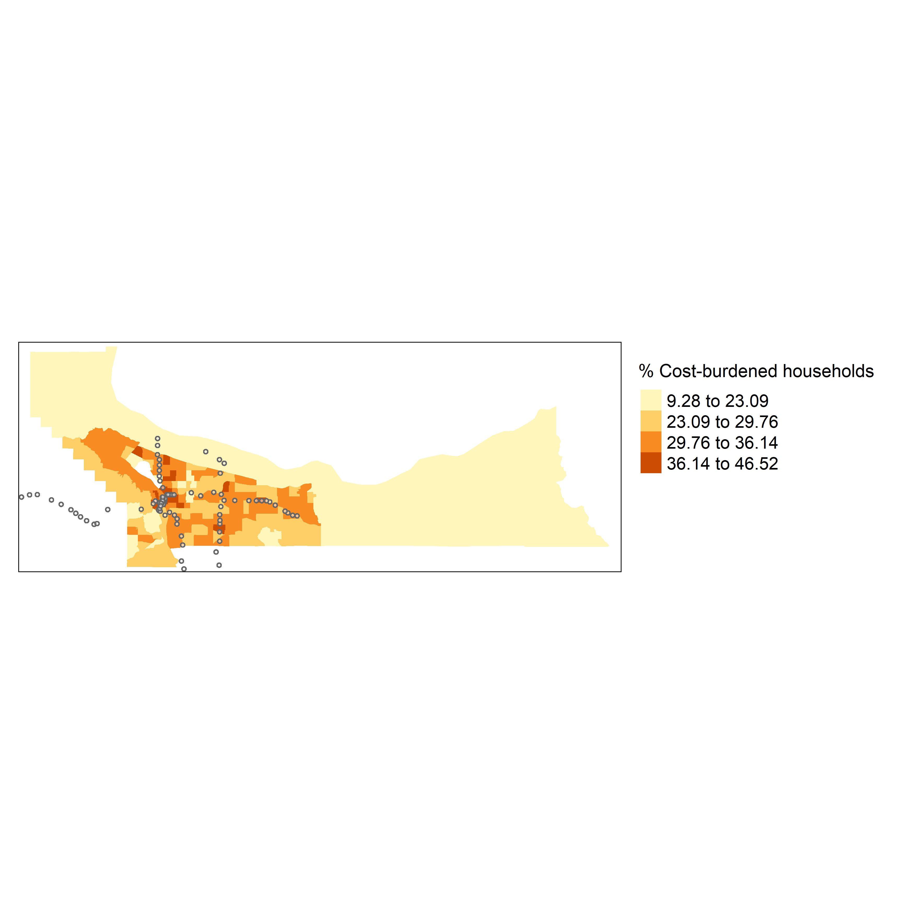
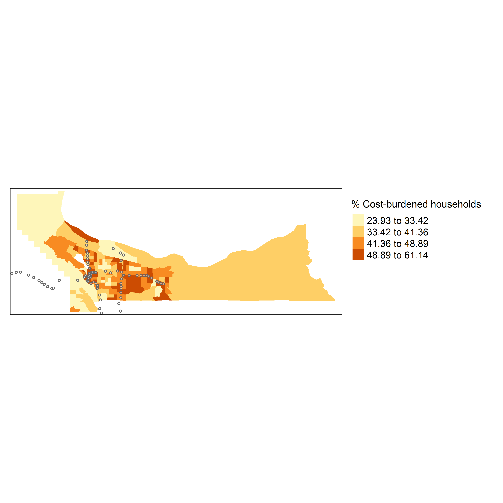
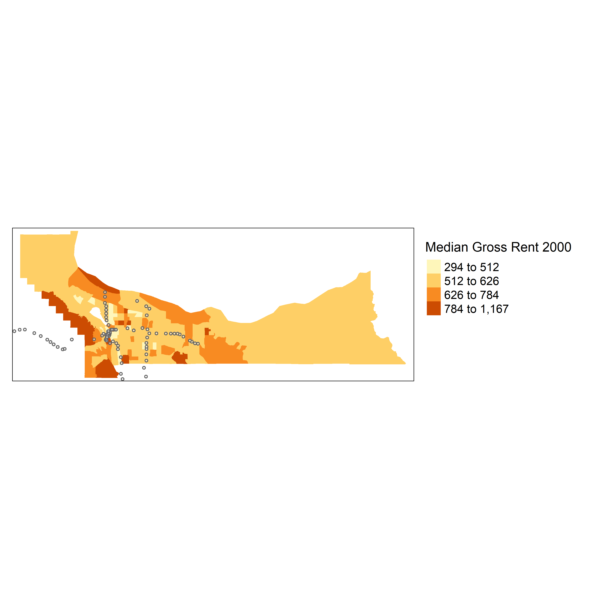
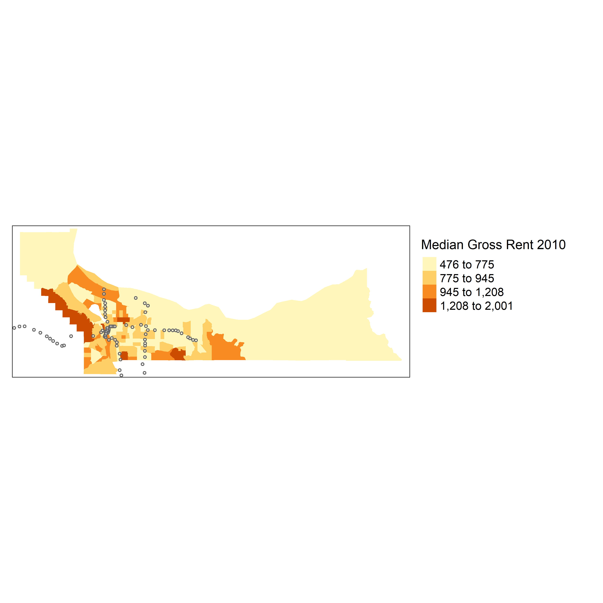
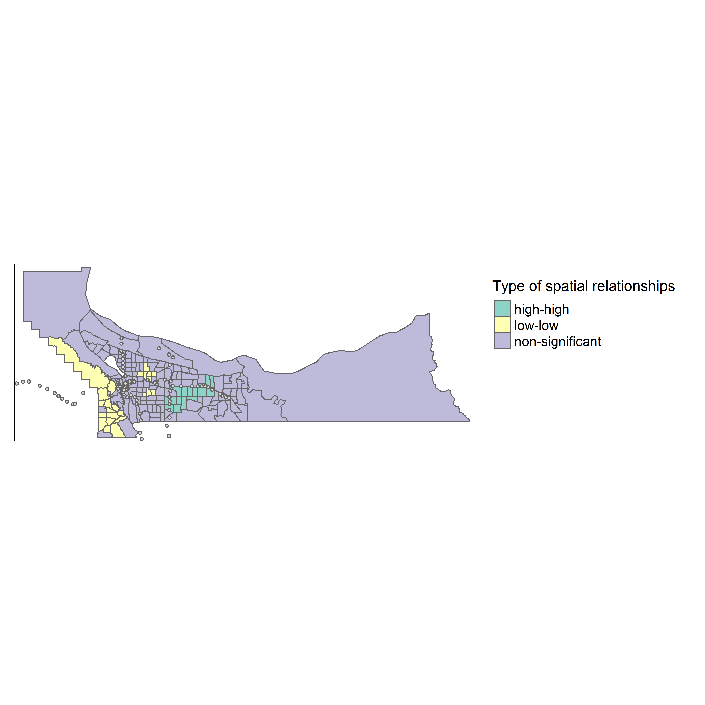
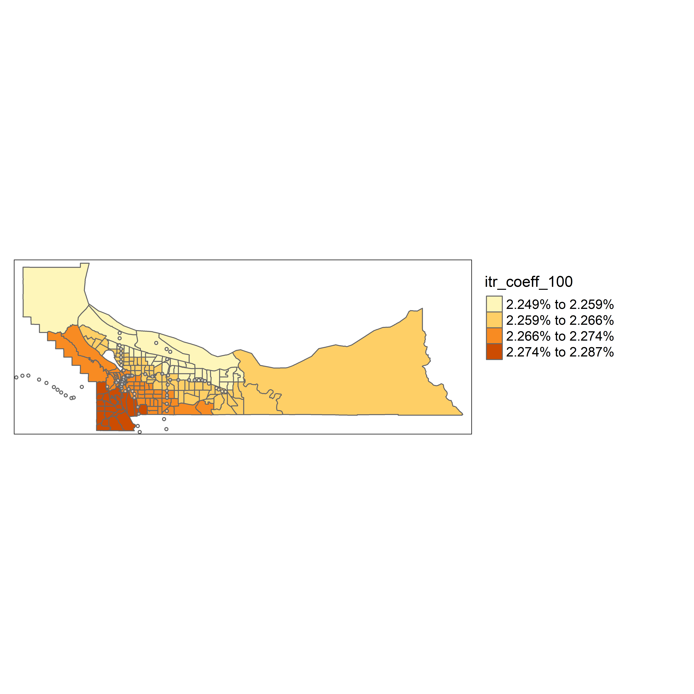
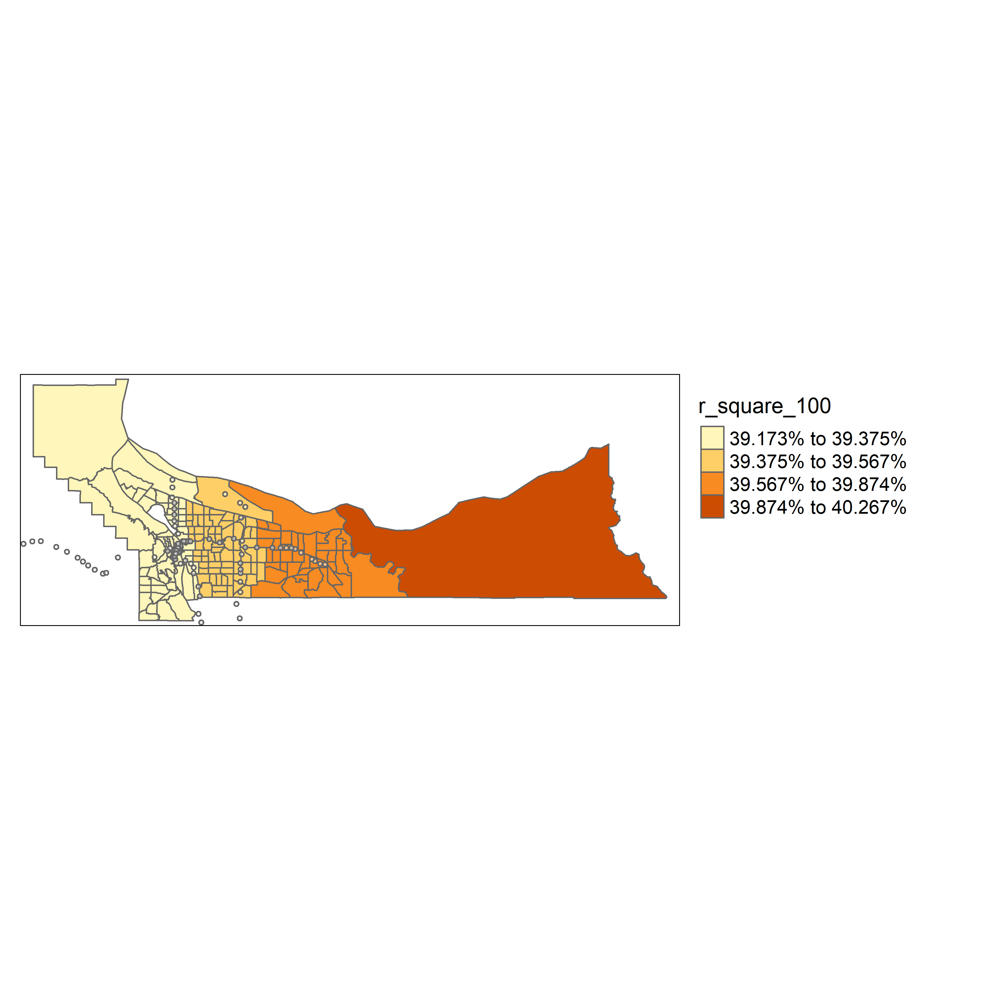

```{r setup, include=FALSE}
knitr::opts_chunk$set(echo = TRUE, message = FALSE)
```

# Activate R Packages
```{r}
library(sf)
library(tmap)
library(tmaptools)
library(tidyverse)
library(spdep)
library(spgwr)
library(tidycensus)
library(readxl)
census_api_key("0dab7f51722dd2227c07f8183a4391b3b7ad7cc3", overwrite = TRUE) 
library(pwr)
```

# A. Clean up data for Multnomah County

## 1. Convert 2000 census data into 2010 boundaries

The data imported here is downloaded from 2000 Census Data (DP4) for the number of cost-burdened households. The crosswork conversion data is from Brown University's LTDB data.

### Import data
```{r import data}
costburden_00 <- read_excel("data/mul_costburden00.xlsx",2)
crossw_0010 <- read_excel("data/mul_costburden00.xlsx",3)

# inner join
costburden_cw <- inner_join(costburden_00,crossw_0010,c("GEO_ID"="trtid00"))

# rename variables
costburden_cw <- costburden_cw %>% 
  rename(
    hu=DP4_C0,
    hu_ow=DP4_C109,burden_ow_3034=DP4_C156,burden_ow_35=DP4_C158,
    hu_re=DP4_C162,burden_re_3034=DP4_C189,burden_re_35=DP4_C191
  )
```

### Apply weights and compress 2000 data into 2010 tract boundaries

```{r apply weights}
costburden_cw1 <- costburden_cw %>% 
  mutate(
    hu=hu*weight,
    hu_ow=hu_ow*weight,
    burden_ow=(burden_ow_3034+burden_ow_35)*weight,
    hu_re=hu_re*weight,
    burden_re=(burden_re_3034+burden_re_35)*weight
  )

# compress to 2010 tract boundaries
costburden_cw2 <- costburden_cw1 %>% 
  group_by(trtid10) %>% 
  summarise(
    hu=sum(hu),hu_ow=sum(hu_ow),burden_ow=sum(burden_ow),
    hu_re=sum(hu_re),burden_re=sum(burden_re)
  )

# prepare the data for join
costburden_cw2$GEOID <- as.character(costburden_cw2$trtid10)

costburden_cw3 <- costburden_cw2 %>% 
  mutate(
    p_burden=(burden_ow+burden_re)/hu,
    p_burden_ow=burden_ow/hu_ow,
    p_burden_re=burden_re/hu_re
    ) %>% 
  select(GEOID,p_burden,p_burden_ow,p_burden_re)
```

## 2. Extract LTDB variables (standard data)

LTDB's standard data has already converted 2000 data for a selection of variables into 2010 boundaries.

### Input standard data (full count)

```{r}
ltdb00 <- read_csv("data/LTDB_Std_All_fullcount/LTDB_Std_2000_fullcount.csv")
ltdb10 <- read_csv("data/LTDB_Std_All_fullcount/LTDB_Std_2010_fullcount.csv")

ltdb00$year <- 2000
ltdb10$year <- 2010

ltdb00 <- ltdb00 %>% 
  mutate(p_nhwht=NHWHT00/POP00,p_rent=RENT00/OHU00) %>% 
  rename(pop=POP00,trtid10=TRTID10) %>% 
  select(year,trtid10,state,county,tract,pop,p_nhwht,p_rent)

ltdb10 <- ltdb10 %>% 
  mutate(p_nhwht=nhwht10/pop10,p_rent=rent10/ohu10) %>% 
  rename(pop=pop10,trtid10=tractid) %>% 
  select(year,state,county,tract,trtid10,pop,p_nhwht,p_rent)
```


### Input standard data (sample)

```{r}
ltdb00s <- read_csv("data/ltdb_std_all_sample/ltdb_std_2000_sample.csv")
ltdb10s <- read_csv("data/ltdb_std_all_sample/ltdb_std_2010_sample.csv")

ltdb00s$year <- 2000
ltdb10s$year <- 2010

ltdb00s <- ltdb00s %>% 
  mutate(pov=NPOV00/DPOV00,col=COL00/AG25UP00,unemp=UNEMP00/CLF00) %>% 
  rename(hinc=HINC00,trtid10=TRTID10,
         mhmval=MHMVAL00,mrent=MRENT00) %>% 
  select(year,trtid10,mhmval,mrent,hinc,col,pov,unemp)

ltdb10s <- ltdb10s %>% 
  mutate(mrent=mrent12,pov=ppov12,) %>% 
  rename(hinc=hinc12,col=col12/ag25up12,unemp=unemp12/clf12,trtid10=tractid,
         mhmval=mhmval12) %>% 
  select(year,trtid10,mhmval,mrent,hinc,col,pov,unemp)

ltdb00_cb <- inner_join(ltdb00,ltdb00s,by=c("year","trtid10"))
ltdb10_cb <- inner_join(ltdb10,ltdb10s,by=c("year","trtid10"))
```

## 3. Join with cost burden variable

### Download ACS 5-Year 2008-2012

```{r}
api_key<-"017877d10fb686c4683f0f204796c1efa957d404"
DL_Year<-2012
survey<- "acs5"
state<- "OR"
geography<- "tract"

B25106_Vars <- c("B25106_001",
                 "B25106_002",
                 "B25106_006",
                 "B25106_010",
                 "B25106_014", 
                 "B25106_018", 
                 "B25106_022",
                 "B25106_024",
                 "B25106_028", 
                 "B25106_032",
                 "B25106_036",
                 "B25106_040",
                 "B25106_044")

B25106 <- get_acs(geography = geography,  state = state, variables = B25106_Vars, survey = survey, year = DL_Year, output = "wide")

B25106$hh<- B25106$B25106_001E
B25106$p_burden<-(B25106$B25106_006E+
                        B25106$B25106_010E+
                        B25106$B25106_014E+
                        B25106$B25106_018E+
                        B25106$B25106_022E+
                        B25106$B25106_028E+
                        B25106$B25106_032E+
                        B25106$B25106_036E+
                        B25106$B25106_040E+
                        B25106$B25106_044E)/B25106$B25106_001E
B25106$ho<- B25106$B25106_002E
B25106$p_burden_own<-(B25106$B25106_006E+
                            B25106$B25106_010E+
                            B25106$B25106_014E+
                            B25106$B25106_018E+
                            B25106$B25106_022E)/B25106$B25106_002E
B25106$hr<- B25106$B25106_024E
B25106$p_burden_rent<-
  (B25106$B25106_028E+
     B25106$B25106_032E+
     B25106$B25106_036E+
     B25106$B25106_040E+
     B25106$B25106_044E)/B25106$B25106_024E
B25106$hh[B25106$hh == "NaN"]<-NA
B25106$p_burden[B25106$p_burden == "NaN"]<-NA
B25106$p_burden_own[B25106$p_burden_own == "NaN"]<-NA
B25106$p_burden_rent[B25106$p_burden_rent == "NaN"]<-NA
B25106<- B25106 %>%  select(GEOID, hh, p_burden, p_burden_own, p_burden_rent)

B25106b <- B25106%>% mutate(county = substr(GEOID, 3, 5))
multnomah12 <- B25106b %>% filter(county == "051")
multnomah12b <- multnomah12[c(1,3:5)]
```

### Combine both 2000 and 2010 data

```{r}
# 2000
ltdb00_cb$GEOID <- as.character(ltdb00_cb$trtid10)
multnomah00 <- inner_join(ltdb00_cb,costburden_cw3,by="GEOID")
multnomah00$year_dm <- 0

# 2010
ltdb10_cb$GEOID <- as.character(ltdb10_cb$trtid10)
multnomah10 <- inner_join(ltdb10_cb,multnomah12b,by="GEOID")
multnomah10$year_dm <- 1

multnomah00b <- multnomah00 %>% filter(hinc>=0,mrent>=0,mhmval>=0)
multnomah10b <- multnomah10 %>% filter(hinc>=0,mrent>=0,mhmval>=0)

# prepare for joining
multnomah00c <- multnomah00b %>% select(year,GEOID,tract,
                       year_dm,hinc,p_nhwht,col,pov,unemp,p_rent,mrent,mhmval, # explanatory v
                       p_burden,p_burden_ow,p_burden_re) # response v

multnomah10b <- multnomah10b %>% 
  rename(p_burden=p_burden,
         p_burden_ow=p_burden_own,
         p_burden_re=p_burden_rent)

multnomah10c <- multnomah10b %>% select(year,GEOID,tract,
                       year_dm,hinc,p_nhwht,col,pov,unemp,p_rent,mrent,mhmval, # explanatory v
                       p_burden,p_burden_ow,p_burden_re) # response v

# combine data
multnomah0010 <- bind_rows(multnomah00c,multnomah10c)

# find out the mismatch between 2000 and 2010 data by tract ID
anti_join(multnomah00c,multnomah10c,by="GEOID")
```

## 4. Join with tract-station-join shapefile

I created these spatial join data between tract and max station in ArcGIS.

```{r}
trt10_buffer <- read_excel(path = "data/multnomah_lrt.xlsx")

# create a variable for whether a centroid of tract is located in a station
trt10_buffer2 <- trt10_buffer %>% 
  mutate(
    lrt = if_else(is.na(BUFF_DIST),"0","1")
           )

# change label
trt10_buffer2$lrt <- factor(trt10_buffer2$lrt,levels=0:1,
                            labels = c("without","within"))

trt10_buffer3 <- trt10_buffer2[c(6,2,17:20,23)]

# import tract shapefile downloaded from U.S. Census Bureau 
trt10 <- read_sf("data/tl_2010_41051_tract10/tl_2010_41051_tract10.shp")
trt10 <- trt10[-c(1:2,7:12)]

# join data
multnomah0010_sf <- inner_join(trt10,multnomah0010,c("GEOID10"="GEOID"))
multnomah0010_sf1 <- inner_join(multnomah0010_sf,trt10_buffer3,by="TRACTCE10")

multnomah0010_sf2 <- multnomah0010_sf1
multnomah0010_sf2$year <- factor(multnomah0010_sf2$year)
```

## 5. Join with tract-city-join shapefile

I created these spatial join data between tract and city in ArcGIS.

```{r}
mul_trt_10_city <- read_excel("data/mul_trt_10_city.xlsx") # spatial join with Place files, OR

mul_trt_10_city$city_fg <- factor(mul_trt_10_city$Join_Count,levels=0:1,
                               labels=c("without","within"))

mul_trt_10_city <- mul_trt_10_city %>% 
  mutate(
    city = if_else(city_fg=="without","without",
                   if_else(NAME10...21=="Portland","portland","others"))
  )
  
mul_trt_10_city$city <- factor(mul_trt_10_city$city,order=F,
                               levels=c("without","portland","others"))

mul_trt_10_city$GEOID10 <- mul_trt_10_city$GEOID10...7

multn0010_sf3 <- inner_join(multnomah0010_sf2,mul_trt_10_city,by="GEOID10")
multn0010_sf4 <- multn0010_sf3[-c(1,7,20:24,26:57)]

# remove the observation of the mismatch tract between 2000 and 2010
multn0010_sf5 <- multn0010_sf4 %>% filter(GEOID10!="41051980000")
```

## 6. Prepare data for modeling

```{r}
multn0010_sf6 <- multn0010_sf5 %>% 
  mutate(
    core = if_else(city=="portland","within","without")
  )

multn0010_sf6$core <- factor(multn0010_sf6$core,order=F,
                               levels=c("without","within"))

multn0010_sf7 <- multn0010_sf6 %>% 
  mutate(
    hinc.aj=if_else(year=="2000",hinc*1.28,hinc), 
    # http://www.bls.gov/data/inflation_calculator.htm
    # 2000 Jan to 2010 Jan
    mrent.aj=if_else(year=="2000",mrent*1.28,mrent),
    mhmval.aj=if_else(year=="2000",mhmval*1.28,mhmval)
  )
```

# B. Clean up data for Los Angeles County

##  1.Convert 2000 data to 2010 boundaries

### Import data

```{r}
costburden_00 <- read_csv("data/la_costburden.csv")
costburden_00 <- costburden_00 %>% select(GEO_ID,NAME,
                                          DP4_C0,DP4_C109,DP4_C156,DP4_C158,DP4_C162,DP4_C189,DP4_C191)
costburden_00 <- costburden_00[-1,]
costburden_00b <- costburden_00 %>% mutate(GEO_ID = substr(GEO_ID, 10, 20))

crossw_0010 <- read_csv("data/crosswalk_2000_2010.csv")
costburden_cw <- inner_join(costburden_00b,crossw_0010,c("GEO_ID"="trtid00"))
costburden_cw <- costburden_cw %>% 
  rename(
    hu=DP4_C0,
    hu_ow=DP4_C109,burden_ow_3034=DP4_C156,burden_ow_35=DP4_C158,
    hu_re=DP4_C162,burden_re_3034=DP4_C189,burden_re_35=DP4_C191
  )

# inspect data
glimpse(costburden_cw)

# change variable data type to appropriate ones
costburden_cw$hu <- as.numeric(costburden_cw$hu)
costburden_cw$hu_ow <- as.numeric(costburden_cw$hu_ow)
costburden_cw$hu_re <- as.numeric(costburden_cw$hu_re)
costburden_cw$burden_ow_3034 <- as.numeric(costburden_cw$burden_ow_3034)
costburden_cw$burden_ow_35 <- as.numeric(costburden_cw$burden_ow_35)
costburden_cw$burden_re_3034 <- as.numeric(costburden_cw$burden_re_3034)
costburden_cw$burden_re_35 <- as.numeric(costburden_cw$burden_re_35)
```

### Apply weights and compress 2000 data into 2010 tract boundaries

```{r}
costburden_cw1 <- costburden_cw %>% 
  mutate(
    hu=hu*weight,
    hu_ow=hu_ow*weight,
    burden_ow=(burden_ow_3034+burden_ow_35)*weight,
    hu_re=hu_re*weight,
    burden_re=(burden_re_3034+burden_re_35)*weight
  )

# compress to 2010 tract boundaries
costburden_cw2 <- costburden_cw1 %>% 
  group_by(trtid10) %>% 
  summarise(
    hu=sum(hu),hu_ow=sum(hu_ow),burden_ow=sum(burden_ow),
    hu_re=sum(hu_re),burden_re=sum(burden_re)
  )

# prepare the data for join
costburden_cw2$GEOID <- as.character(costburden_cw2$trtid10)
costburden_cw3 <- costburden_cw2 %>% 
  mutate(
    p_burden=(burden_ow+burden_re)/hu,
    p_burden_ow=burden_ow/hu_ow,
    p_burden_re=burden_re/hu_re
    ) %>% 
  select(GEOID,p_burden,p_burden_ow,p_burden_re)

costburden_cw3 <- costburden_cw3 %>% mutate(GEOID = substr(GEOID, 2, 11))
```

## 2. Extract LTDB variables (standard data)

### Input standard data (full count)

```{r}
ltdb00 <- read_csv("data/LTDB_Std_All_fullcount/LTDB_Std_2000_fullcount.csv")
ltdb10 <- read_csv("data/LTDB_Std_All_fullcount/LTDB_Std_2010_fullcount.csv")

ltdb00$year <- 2000
ltdb10$year <- 2010

ltdb00 <- ltdb00 %>% 
  mutate(p_nhwht=NHWHT00/POP00,p_rent=RENT00/OHU00) %>% 
  rename(pop=POP00,trtid10=TRTID10) %>% 
  select(year,trtid10,state,county,tract,pop,p_nhwht,p_rent)

ltdb10 <- ltdb10 %>% 
  mutate(p_nhwht=nhwht10/pop10,p_rent=rent10/ohu10) %>% 
  rename(pop=pop10,trtid10=tractid) %>% 
  select(year,state,county,tract,trtid10,pop,p_nhwht,p_rent)
```


## Input standard data (sample) 

```{r}
ltdb00s <- read_csv("data/ltdb_std_all_sample/ltdb_std_2000_sample.csv")
ltdb10s <- read_csv("data/ltdb_std_all_sample/ltdb_std_2010_sample.csv")

ltdb00s$year <- 2000
ltdb10s$year <- 2010

ltdb00s <- ltdb00s %>% 
  mutate(pov=NPOV00/DPOV00,col=COL00/AG25UP00,unemp=UNEMP00/CLF00) %>% 
  rename(hinc=HINC00,trtid10=TRTID10,
         mhmval=MHMVAL00,mrent=MRENT00) %>% 
  select(year,trtid10,mhmval,mrent,hinc,col,pov,unemp)

ltdb10s <- ltdb10s %>% 
  mutate(mrent=mrent12,pov=ppov12,) %>% 
  rename(hinc=hinc12,col=col12/ag25up12,unemp=unemp12/clf12,trtid10=tractid,
         mhmval=mhmval12) %>% 
  select(year,trtid10,mhmval,mrent,hinc,col,pov,unemp)

ltdb00_cb <- inner_join(ltdb00,ltdb00s,by=c("year","trtid10"))
ltdb10_cb <- inner_join(ltdb10,ltdb10s,by=c("year","trtid10"))
```

## 3. Join with cost burden variable

### Download ACS 5-Year 2008-2012

```{r}
api_key<-"017877d10fb686c4683f0f204796c1efa957d404"
DL_Year<-2012
survey<- "acs5"
state<- "CA"
geography<- "tract"

B25106_Vars <- c("B25106_001",
                 "B25106_002",
                 "B25106_006",
                 "B25106_010",
                 "B25106_014", 
                 "B25106_018", 
                 "B25106_022",
                 "B25106_024",
                 "B25106_028", 
                 "B25106_032",
                 "B25106_036",
                 "B25106_040",
                 "B25106_044")

B25106 <- get_acs(geography = geography,  state = state, variables = B25106_Vars, survey = survey, year = DL_Year, output = "wide")

B25106$hh<- B25106$B25106_001E
B25106$p_burden<-(B25106$B25106_006E+
                        B25106$B25106_010E+
                        B25106$B25106_014E+
                        B25106$B25106_018E+
                        B25106$B25106_022E+
                        B25106$B25106_028E+
                        B25106$B25106_032E+
                        B25106$B25106_036E+
                        B25106$B25106_040E+
                        B25106$B25106_044E)/B25106$B25106_001E
B25106$ho<- B25106$B25106_002E
B25106$p_burden_own<-(B25106$B25106_006E+
                            B25106$B25106_010E+
                            B25106$B25106_014E+
                            B25106$B25106_018E+
                            B25106$B25106_022E)/B25106$B25106_002E
B25106$hr<- B25106$B25106_024E
B25106$p_burden_rent<-
  (B25106$B25106_028E+
     B25106$B25106_032E+
     B25106$B25106_036E+
     B25106$B25106_040E+
     B25106$B25106_044E)/B25106$B25106_024E
B25106$hh[B25106$hh == "NaN"]<-NA
B25106$p_burden[B25106$p_burden == "NaN"]<-NA
B25106$p_burden_own[B25106$p_burden_own == "NaN"]<-NA
B25106$p_burden_rent[B25106$p_burden_rent == "NaN"]<-NA
B25106<- B25106 %>%  select(GEOID, hh, p_burden, p_burden_own, p_burden_rent)

B25106b <- B25106%>% mutate(county = substr(GEOID, 3, 5))
la12 <- B25106b %>% filter(county == "037")
la12b <- la12[c(1,3:5)]
la12b <- la12b %>% mutate(GEOID = substr(GEOID, 2, 11))
```

### Combine 2000 and 2010 data

```{r}
# 2000
costburden_cw3$p_burden[costburden_cw3$p_burden == "NaN"]<-NA
costburden_cw3$p_burden_ow[costburden_cw3$p_burden_ow == "NaN"]<-NA
costburden_cw3$p_burden_re[costburden_cw3$p_burden_re == "NaN"]<-NA

costburden_cw4 <- na.omit(costburden_cw3)

ltdb00_cb$GEOID <- as.character(ltdb00_cb$trtid10)
la00 <- inner_join(ltdb00_cb,costburden_cw4,by="GEOID")
la00$year_dm <- 0

# 2010
ltdb10_cb$GEOID <- as.character(ltdb10_cb$trtid10)

la10 <- inner_join(ltdb10_cb,la12b,by="GEOID")
la10$year_dm <- 1

# remove negative values
la00b <- la00 %>% filter(hinc>=0,mrent>=0,mhmval>=0)
la10b <- la10 %>% filter(hinc>=0,mrent>=0,mhmval>=0)

# prepare for joining
la00c <- la00b %>% select(year,GEOID,tract,
                       year_dm,hinc,p_nhwht,col,pov,unemp,p_rent,mrent,mhmval, # explanatory v
                       p_burden,p_burden_ow,p_burden_re) # response v

la10b <- la10b %>% 
  rename(p_burden=p_burden,
         p_burden_ow=p_burden_own,
         p_burden_re=p_burden_rent)

la10c <- la10b %>% select(year,GEOID,tract,
                       year_dm,hinc,p_nhwht,col,pov,unemp,p_rent,mrent,mhmval, # explanatory v
                       p_burden,p_burden_ow,p_burden_re) # response v

# remove mismatch tracts
delete <- anti_join(la00c,la10c,by="GEOID")
GEOID_dl <- delete$GEOID
la00d <- la00c %>% filter(! GEOID %in% GEOID_dl )

delete2 <- anti_join(la10c,la00d,by="tract")
GEOID_dl2 <- delete2$GEOID
la10d <- la10c %>% filter(! GEOID %in% GEOID_dl2)

# combine data ====
la0010 <- bind_rows(la00d,la10d)
```

## 4. Join with tract-station-join shapefile

```{r}
trt10_buffer <- read_excel(path = "data/la_lrt.xlsx")
trt10_buffer2 <- trt10_buffer %>% 
  mutate(
    lrt = if_else(is.na(BUFF_DIST),0,1)
           )

trt10_buffer2$lrt <- factor(trt10_buffer2$lrt,levels=0:1,
                            labels = c("without","within"))

trt10_buffer3 <- trt10_buffer2[c(7,32)]

trt10 <- read_sf("data/tl_2010_06037_tract10/tl_2010_06037_tract10.shp")
trt10 <- trt10[-c(1:2,7:12)]

trt10b <- trt10 %>% mutate(GEOID10 = substr(GEOID10, 2, 11))

la0010_sf <- inner_join(trt10b,la0010,c("GEOID10"="GEOID"))

trt10_buffer4 <- trt10_buffer3 %>% mutate(GEOID10 = substr(GEOID10, 2, 11))

la0010_sf1 <- inner_join(la0010_sf,trt10_buffer4,by="GEOID10")
```

### Prepate data

```{r}
la0010_sf2 <- la0010_sf1
la0010_sf2$year <- factor(la0010_sf2$year)
levels(la0010_sf2$year)
summary(la0010_sf2$year)
```

## 5. Join with tract-city-join shapefile

```{r}
la_city <- read_excel("data/la_trt_10_city.xlsx")

la_city$city_fg <- factor(la_city$Join_Count,levels=0:1,
                               labels=c("without","within"))

la_city <- la_city %>% 
  mutate(
    city = if_else(city_fg=="without","without",
                   if_else(NAME10...21=="Los Angeles","la","others"))
  )

la_city$city <- factor(la_city$city,order=F,
                               levels=c("without","la","others"))

la_city <- la_city %>% mutate(GEOID10 = substr(GEOID10...7, 2, 11))
la0010_sf3 <- inner_join(la0010_sf2,la_city,by="GEOID10")

la0010_sf4 <- la0010_sf3[-c(1,7,8,21:52)]
```

## 6. Prepare data for modeling

```{r}
la0010_sf5 <- la0010_sf4 %>% 
  mutate(
    core = if_else(city=="la","within","without")
  )

la0010_sf5$core <- factor(la0010_sf5$core,order=F,
                             levels=c("without","within"))

la0010_sf6 <- la0010_sf5 %>% 
  mutate(
    hinc.aj=if_else(year=="2000",hinc*1.28,hinc), 
    # http://www.bls.gov/data/inflation_calculator.htm
    # 2000 Jan to 2010 Jan
    mrent.aj=if_else(year=="2000",mrent*1.28,mrent),
    mhmval.aj=if_else(year=="2000",mhmval*1.28,mhmval)
  )

la0010_sf6 <- la0010_sf6 %>% 
  filter(GEOID10 != "6037599000")
```

# C. Create change varibale for both data sets

## Multnomah Conuty

```{r}
multn0010_sf8 <- multn0010_sf7

multn0010_sf9 <- 
  multn0010_sf8 %>% 
  group_by(GEOID10) %>%
  arrange(year,.by_group=T) %>% 
  mutate(
    hinc_df=log(hinc.aj)-dplyr::lag(log(hinc.aj)), #1
    p_nhwht_df=p_nhwht-dplyr::lag(p_nhwht), #2
    col_df=col-dplyr::lag(col), #3
    pov_df=pov-dplyr::lag(pov), #4
    unemp_df=unemp-dplyr::lag(unemp), #5
    p_rent_df=p_rent-dplyr::lag(p_rent), #6
    mrent_df=log(mrent.aj)-dplyr::lag(log(mrent.aj)), #7
    mhmval_df=log(mhmval.aj)-dplyr::lag(log(mhmval.aj)), #8
    p_burden_df=p_burden-dplyr::lag(p_burden),
    p_burden_ow_df=p_burden_ow-dplyr::lag(p_burden_ow), 
    p_burden_re_df=p_burden_re-dplyr::lag(p_burden_re)
    )

multn0010_sf10 <- multn0010_sf9 %>% filter(year=="2010")

# multn0010_sf10.3: all change variables between 2000 and 2012
multn0010_sf10.3 <- multn0010_sf10[,-c(5:17,22:24)]


# multn0010_sf10: change variable to 2010 data
multn0010_sf10.2 <- multn0010_sf10[,c(1,33:35)]
multn0010_sf10 <- multn0010_sf10[,-c(25:32)]


# multn0010_sf11: change variable to 2000 data
multn0010_sf11 <- multn0010_sf9 %>% filter(year=="2000")
multn0010_sf11 <- multn0010_sf11[,-c(25:35)]

multn0010_sf10.2 <- st_drop_geometry(multn0010_sf10.2)

multn0010_sf11 <- multn0010_sf11 %>% # change variable to 2000 data
  inner_join(multn0010_sf10.2,by="GEOID10")
```

## Los Angeles County

```{r}
la0010_sf7 <- 
  la0010_sf6 %>% 
  group_by(GEOID10) %>%
  arrange(year,.by_group=T) %>% 
  mutate(
    hinc_df=log(hinc.aj)-dplyr::lag(log(hinc.aj)), #1
    p_nhwht_df=p_nhwht-dplyr::lag(p_nhwht), #2
    col_df=col-dplyr::lag(col), #3
    pov_df=pov-dplyr::lag(pov), #4
    unemp_df=unemp-dplyr::lag(unemp), #5
    p_rent_df=p_rent-dplyr::lag(p_rent), #6
    mrent_df=log(mrent.aj)-dplyr::lag(log(mrent.aj)), #7
    mhmval_df=log(mhmval.aj)-dplyr::lag(log(mhmval.aj)), #8
    # lrt_df=lrt-lag(lrt), #9
    # city_df=city-lag(city), #10
    # itr_city_df=itr_lrt_city-lag(itr_lrt_city), #11
    p_burden_df=p_burden-dplyr::lag(p_burden),
    p_burden_ow_df=p_burden_ow-dplyr::lag(p_burden_ow), 
    p_burden_re_df=p_burden_re-dplyr::lag(p_burden_re)
    )

la0010_sf8 <- la0010_sf7 %>% filter(year=="2010") # change variable to 2010 data

# la0010_sf8.3: all change variables between 2000 and 2012
la0010_sf8.3 <- la0010_sf8[,-c(5:16,21:23)]

# la0010_sf8: change variable to 2010 data
la0010_sf8.2 <- la0010_sf8[-c(2:23)]
la0010_sf8.2 <- st_drop_geometry(la0010_sf8.2)
la0010_sf8 <- la0010_sf8[,-c(24,31)]


# la0010_sf9: change variable to 2000 data
la0010_sf9 <- la0010_sf7 %>% filter(year=="2000") # change variable to 2000 data
la0010_sf9 <- la0010_sf9[,-c(24:34)]

la0010_sf9 <- la0010_sf9 %>% # change variable to 2000 data
  inner_join(la0010_sf8.2,by="GEOID10")
```


# D. OLS modeling

```{r rent}
# with interaction term
ols.mul.change1 <- lm(mrent_df~
             lrt*core+ # independent v
             hinc_df+p_nhwht_df+col_df+pov_df+unemp_df+ # socioecon v
             p_rent_df+mhmval_df, # housing v
             data=multn0010_sf10.3)


summary(ols.mul.change1)

ols.la.change1 <- lm(mrent_df~
             lrt*core+ # independent v
             hinc_df+p_nhwht_df+col_df+pov_df+unemp_df+ # socioecon v
             p_rent_df+mhmval_df, # housing v
             data=la0010_sf8.3)


summary(ols.la.change1)
```


```{r}
# with interaction term
ols.mul.change1 <- lm(p_burden_df~
             lrt*core+ # independent v
             hinc_df+p_nhwht_df+col_df+pov_df+unemp_df+ # socioecon v
             p_rent_df+mrent_df+mhmval_df, # housing v
             data=multn0010_sf10.3)


summary(ols.mul.change1)

ols.la.change1 <- lm(p_burden_df~
             lrt*core+ # independent v
             hinc_df+p_nhwht_df+col_df+pov_df+unemp_df+ # socioecon v
             p_rent_df+mrent_df+mhmval_df, # housing v
             data=la0010_sf8.3)


summary(ols.la.change1)
```

```{r diagnosis}
library(gvlma)
ols.mul.dig <- gvlma(ols.mul.change1)
summary(ols.mul.dig)

ols.la.dig <- gvlma(ols.la.change1)
summary(ols.la.dig)
```

## Export output table

```{r}
require(broom) # for tidy()
require(knitr) # for kable()
out.ols.mul <- tidy(ols.mul.change1)
kable(out.ols.mul)

out.ols.la <- tidy(ols.la.change1)
kable(out.ols.la)
```

```{r}
# without interaction term
ols.mul.change2 <- lm(p_burden_df~
             lrt+core+ # independent v
             hinc_df+p_nhwht_df+col_df+pov_df+unemp_df+ # socioecon v
             p_rent_df+mrent_df+mhmval_df, # housing v
             data=multn0010_sf10.3)


summary(ols.mul.change2)

ols.la.change2 <- lm(p_burden_df~
             lrt+core+ # independent v
             hinc_df+p_nhwht_df+col_df+pov_df+unemp_df+ # socioecon v
             p_rent_df+mrent_df+mhmval_df, # housing v
             data=la0010_sf8.3)


summary(ols.la.change2)
```

```{r}
anova(ols.mul.change2, ols.mul.change1)
anova(ols.la.change2, ols.la.change1)
```

# E. Spatial analysis

## Multnomah County

### Import station shapefiles

```{r}
tm_rail_stops <- st_read("data/tm_rail_stops/tm_rail_stops.shp")

max_rail_stops <- tm_rail_stops %>% filter(type=="MAX")
table(max_rail_stops$type)
max_buffer <- st_buffer(max_rail_stops, 1000)
```

### Global morans I test

```{r}
multn0010_sf7$p_burden_100 <- multn0010_sf7$p_burden*100

multn0010_sf7.1 <- multn0010_sf7 %>% filter(year == "2000")
multn0010_sf7.2 <- multn0010_sf7 %>% filter(year == "2010")
```

```{r}
# test for the percentage of cost-burdened households in 2000
nb.mul <- poly2nb(multn0010_sf7.1, queen=TRUE)
w.mul <- nb2listw(nb.mul, style="B", zero.policy=TRUE)
# Note we are testing for this global model
moran.test(multn0010_sf7.2$p_burden,w.mul)
```

```{r}
# test for the percentage of cost-burdened households in 2010
nb.mul <- poly2nb(multn0010_sf7.2, queen=TRUE)
w.mul <- nb2listw(nb.mul, style="B", zero.policy=TRUE)
# Note we are testing for this global model
moran.test(multn0010_sf7.1$p_burden,w.mul)
```

```{r}
# test for the change in the percentage between 2000 and 2010
nb.mul.df <- poly2nb(multn0010_sf10.3, queen=TRUE)
w.mul.df <- nb2listw(nb.mul.df, style="B", zero.policy=TRUE)
# Note we are testing for this global model
moran.test(multn0010_sf10.3$p_burden_df,w.mul.df)
```

### Mapping cost burden in 2000 and 2010

```{r}
png("img_output/portland/p-cost-burden-2000.png", units = "in", width = 7, height = 7, res = 500)

tm_shape(multn0010_sf7.1) + 
  tm_polygons(style="jenks",border.col = "NA", n=4,
              col = "p_burden_100", title="% Cost-burdened households")+
  tm_legend(outside = TRUE, text.size = .8)+
  tm_shape(max_buffer) + tm_polygons(col = "white", alpha = 0.5)

dev.off()

png("img_output/portland/p-cost-burden-2010.png", units = "in", width = 7, height = 7, res = 500)

tm_shape(multn0010_sf7.2) + 
  tm_polygons(style="jenks",border.col = "NA", n=4,
              col = "p_burden_100", title="% Cost-burdened households")+
  tm_legend(outside = TRUE, text.size = .8)+
  tm_shape(max_buffer) + tm_polygons(col = "white", alpha = 0.5)

dev.off()
```





## Mapping rent

```{r}
png("img_output/portland/rent-2000.png", units = "in", width = 7, height = 7, res = 500)

tm_shape(multn0010_sf7.1) + 
  tm_polygons(style="jenks",border.col = "NA", n=4,
              col = "mrent", title="Median Gross Rent 2000")+
  tm_legend(outside = TRUE, text.size = .8)+
  tm_shape(max_buffer) + tm_polygons(col = "white", alpha = 0.5)

dev.off()

png("img_output/portland/rent-2010.png", units = "in", width = 7, height = 7, res = 500)

tm_shape(multn0010_sf7.2) + 
  tm_polygons(style="jenks",border.col = "NA", n=4,
              col = "mrent", title="Median Gross Rent 2010")+
  tm_legend(outside = TRUE, text.size = .8)+
  tm_shape(max_buffer) + tm_polygons(col = "white", alpha = 0.5)

dev.off()
```





### Local model for 2010 percentage of burdened households

```{r}
local.mul <- localmoran(multn0010_sf7.2$p_burden, w.mul)
# Simply get the five number of summary of each column.
summary(local.mul)

multn0010_sf7.2$p_burden_s <- scale(multn0010_sf7.2$p_burden)
multn0010_sf7.2$p_burden_s_lag <- lag.listw(w.mul, multn0010_sf7.2$p_burden_s)

multn0010_sf7.2 <- multn0010_sf7.2 %>% mutate(
  quad_sig = ifelse(multn0010_sf7.2$p_burden_s > 0 &
                      multn0010_sf7.2$p_burden_s_lag > 0 &
                      local.mul[,5] <= 0.05,
                    "high-high",
                    ifelse(multn0010_sf7.2$p_burden_s <= 0 &
                             multn0010_sf7.2$p_burden_s_lag <= 0 &
                             local.mul[,5] <= 0.05,
                           "low-low",
                           ifelse(multn0010_sf7.2$p_burden_s > 0 &
                                    multn0010_sf7.2$p_burden_s_lag <= 0 &
                                    local.mul[,5] <= 0.05,
                                  "high-low",
                                  ifelse(multn0010_sf7.2$p_burden_s <= 0 &
                                           multn0010_sf7.2$p_burden_s_lag > 0 &
                                           local.mul[,5] <= 0.05,
                                         "low-high",
                                         "non-significant")))))

png("img_output/portland/p-cost-burden-2010-longi-quadsig.png", units = "in", width = 7, height = 7, res = 500)

tm_shape(multn0010_sf7.2) + tm_polygons(col = "quad_sig",
                                      title="Type of spatial relationships") +
  tm_legend(outside = TRUE, text.size = .8) +
  tm_shape(max_buffer) + tm_polygons()

dev.off()
```



### Local model for change variable

```{r}
local.mul <- localmoran(multn0010_sf10.3$p_burden_df, w.mul.df)
# Simply get the five number of summary of each column.
summary(local.mul)

multn0010_sf10.3$p_burden_df_s <- scale(multn0010_sf10.3$p_burden_df)
multn0010_sf10.3$p_burden_df_s_lag <- lag.listw(w.mul.df, multn0010_sf10.3$p_burden_df_s)

multn0010_sf10.3$quad_sig <- 
  if_else(multn0010_sf10.3$p_burden_df_s > 0 & 
            multn0010_sf10.3$p_burden_df_s_lag > 0 &
            local.mul[,5] <= 0.05, "high-high",
          if_else(multn0010_sf10.3$p_burden_df_s <= 0 &
                    multn0010_sf10.3$p_burden_df_s_lag <= 0 & 
                    local.mul[,5] <= 0.05, "low-low",
                  if_else(multn0010_sf10.3$p_burden_df_s > 0 &
                            multn0010_sf10.3$p_burden_df_s_lag <= 0 &
                            local.mul[,5] <= 0.05, "high-low",
                          if_else(multn0010_sf10.3$p_burden_df_s <= 0 &
                                    multn0010_sf10.3$p_burden_df_s_lag > 0 &
                                    local.mul[,5] <= 0.05, "low-high",
                                  "non-significant"))))

png("img_output/portland/p-cost-burden-df-longi-quadsig.png", units = "in", width = 7, height = 7, res = 500)

tm_shape(multn0010_sf10.3) + tm_polygons(col = "quad_sig",
                                      title="Type of spatial relationships") +
  tm_legend(outside = TRUE, text.size = .8) +
  tm_shape(max_buffer) + tm_polygons(col = "white", alpha = 0.5)

dev.off()
```


#### Modeling

```{r}
# convert simple feature as sp objects. Attributes are preserved, just the data type is changed
mul_sp_from_sf <- as(multn0010_sf10.3, Class="Spatial")
# Select the best bandwith using gwr.sel. The returned value is the best bandwith for the model

gwr.sel(p_burden_df~
          lrt*core+ # independent v
          hinc_df+p_nhwht_df+col_df+pov_df+unemp_df+ # socioecon v
          p_rent_df+mrent_df+mhmval_df, # housing v
        adapt = T,
        data=mul_sp_from_sf)
```

```{r}
# Establish the GWR.
set.seed(1)
gwr.mul <- gwr(p_burden_df~
                 lrt*core+ # independent v
                 hinc_df+p_nhwht_df+col_df+pov_df+unemp_df+ # socioecon v
                 p_rent_df+mrent_df+mhmval_df, # housing v
               data=mul_sp_from_sf,
               adapt = 0.9352654,hatmatrix=TRUE,se.fit = T)
```

```{r}
gwr.mul
```

```{r}
gwr.mul <- gwr(p_burden_df~
                 lrt*core+ # independent v
                 hinc_df+p_nhwht_df+col_df+pov_df+unemp_df+ # socioecon v
                 p_rent_df+mrent_df+mhmval_df, # housing v
               data=mul_sp_from_sf,
               bandwidth=36.23472,hatmatrix=TRUE)
```


```{r}
gwr.mul
```

```{r}
# Convert results back to sf objects
gwr.mul_sf <- st_as_sf(gwr.mul$SDF)

# We need coefficient, R2, predicted value and residuals for each county.
multn0010_sf10.3$corewithin  <- gwr.mul_sf$corewithin 
multn0010_sf10.3$lrtwithin.corewithin  <- gwr.mul_sf$lrtwithin.corewithin 
multn0010_sf10.3$itr_coeff <- multn0010_sf10.3$corewithin + multn0010_sf10.3$lrtwithin.corewithin

multn0010_sf10.3$r_square <- gwr.mul_sf$localR2
multn0010_sf10.3$residual_gwr <- gwr.mul_sf$gwr.e
multn0010_sf10.3$pred_gwr <- gwr.mul_sf$pred

sd(multn0010_sf10.3$itr_coeff)

summary(multn0010_sf10.3)
```

##### Visualization

```{r}
multn0010_sf10.3$itr_coeff_100 <- multn0010_sf10.3$itr_coeff*100
multn0010_sf10.3$r_square_100 <- multn0010_sf10.3$r_square*100

png("img_output/portland/lrt-impact.png", units = "in", width = 7, height = 7, res = 700)
tm_shape(multn0010_sf10.3) + 
  tm_polygons(style="jenks",n=4,col = "itr_coeff_100",
              legend.format=list(fun=function(x) paste0(formatC(x, digits=3, format="f"), "%"))) +
  tm_legend(outside = TRUE, text.size = .8)+
  tm_shape(max_buffer) + tm_polygons(col = "white", alpha = 0.5)
dev.off()

png("img_output/portland/rqaure.png", units = "in", width = 7, height = 7, res = 500)
tm_shape(multn0010_sf10.3) + 
  tm_polygons(style="jenks",n=4,col = "r_square_100",
              legend.format=list(fun=function(x) paste0(formatC(x, digits=3, format="f"), "%"))) +
  tm_legend(outside = TRUE, text.size = .8)+
  tm_shape(max_buffer) + tm_polygons(col = "white", alpha = 0.5)
dev.off()

```





